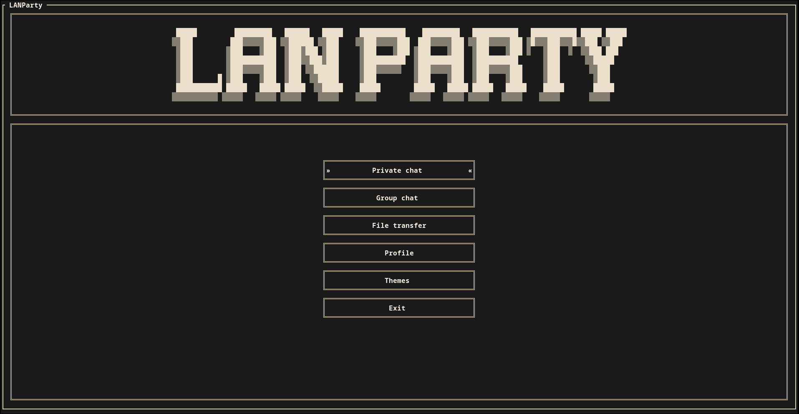
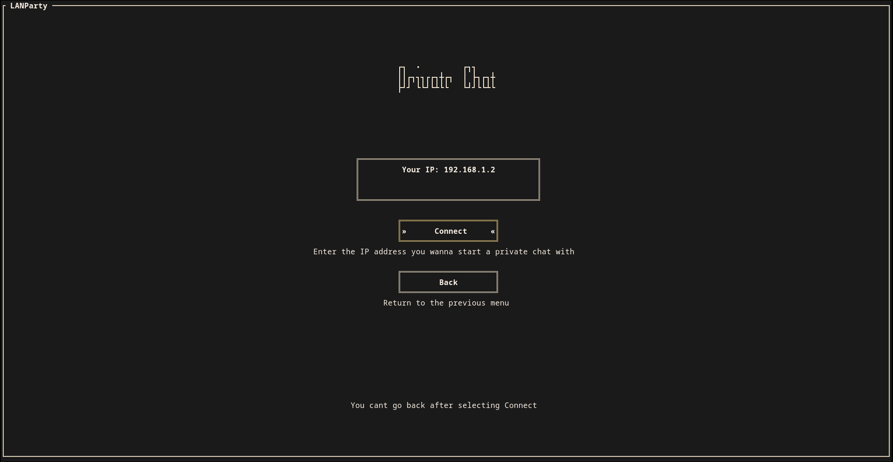
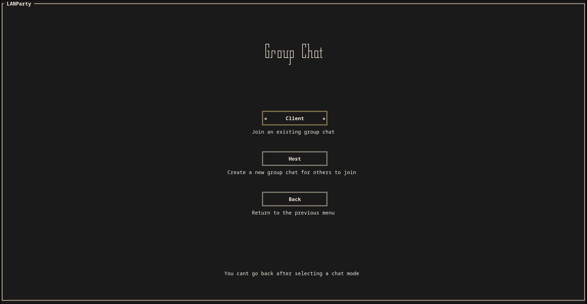
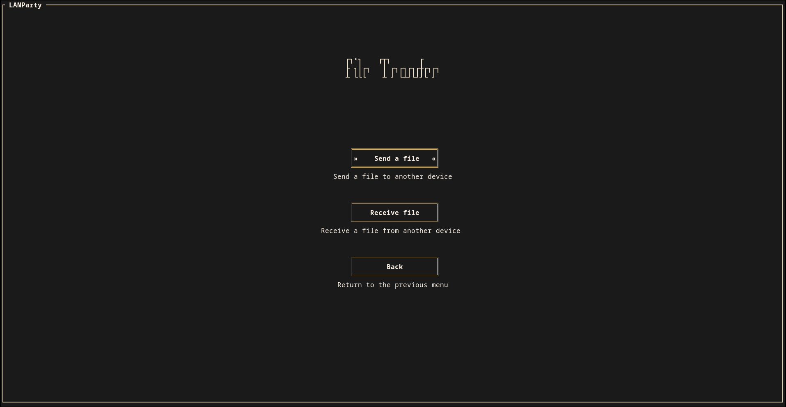
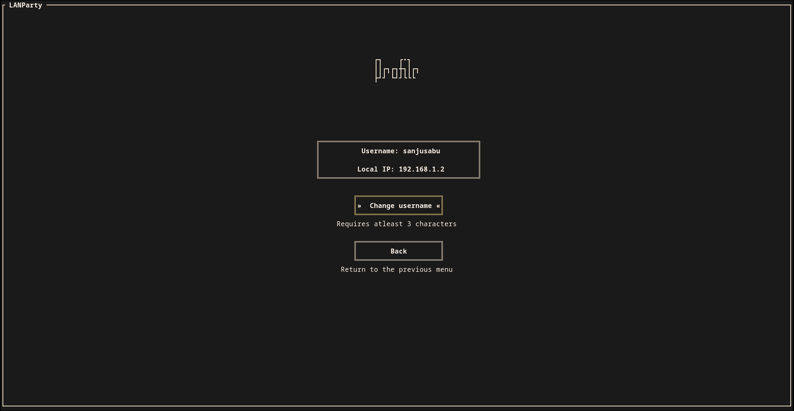
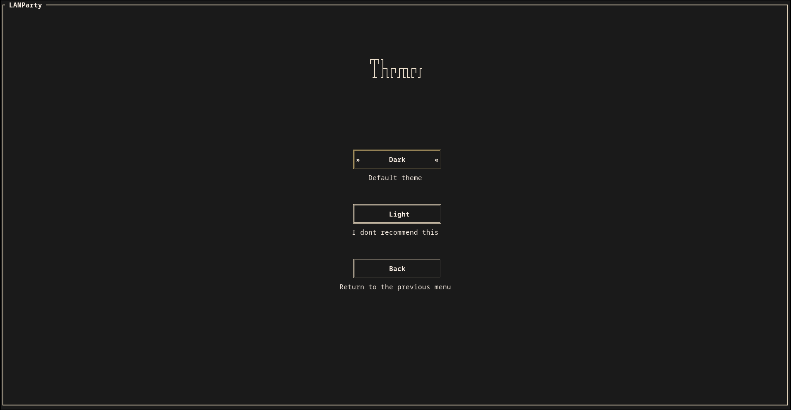

# LAN Party

A terminal chat application for LANs.

## Screenshots

<table>
  <tr>
    <td align="center">
      <br/>
      <sub><b>Home menu</b></sub>
    </td>
    <td align="center">
      <br/>
      <sub><b>Private chat</b></sub>
    </td>
  </tr>
  <tr>
    <td align="center">
      <br/>
      <sub><b>Group chat</b></sub>
    </td>
    <td align="center">
      <br/>
      <sub><b>File transfer</b></sub>
    </td>
  </tr>
  <tr>
    <td align="center">
      <br/>
      <sub><b>User profile</b></sub>
    </td>
    <td align="center">
      <br/>
      <sub><b>Themes</b></sub>
    </td>
  </tr>
</table>

## What it does

- Private chat (soon)
- Group chat
    - Automatic host discovery with a host selector
- File Transfer (soon)

## How it works

(soon)

## Installation

```bash
cargo install lanparty
```

## Usage

```bash
lanparty

# or

$HOME/.cargo/bin/lanparty
```

## License

GPL-3
