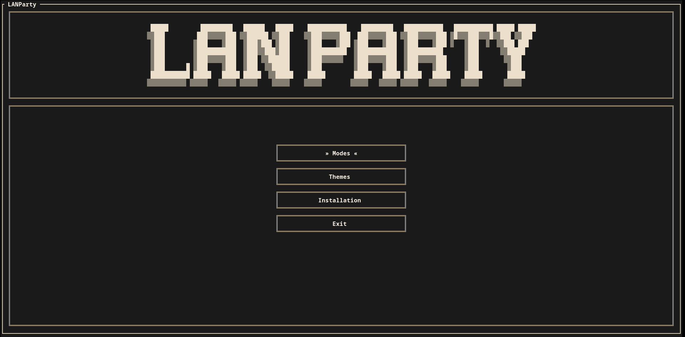
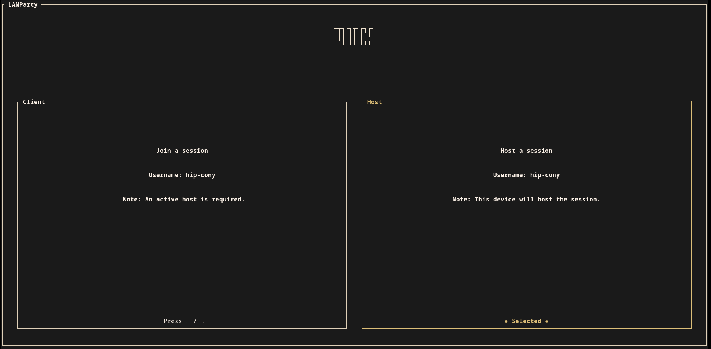
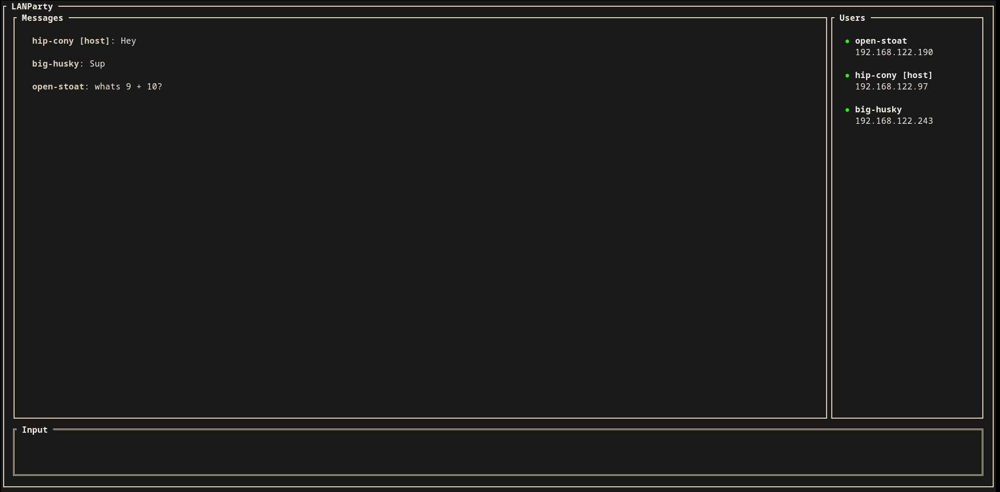

# LAN Party

A terminal chat application for local area networks.

## Home Screen



## Modes Menu



## Chat


## Features

- Automatic host discovery over LAN
- Real-time chat messaging
- Live user list with online/offline status
- Light and dark themes

## How it works

When someone hosts a chat, LAN Party broadcasts `b"LANPARTY"` over UDP on port `55555`. Other clients listen on the same port for that packet. Once a host is found, the client connects to it over TCP.

After that, every message is sent to the host, which forwards it to everyone else in the chat.
## Installation

```bash
cargo install lanparty
```

## Usage

```bash
lanparty

# or

$HOME/.cargo/bin/lanparty
```

## License

GPL-3
